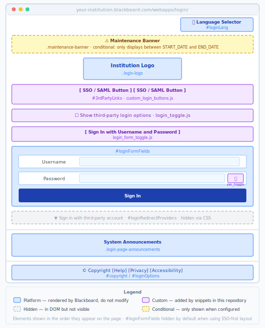

# Blackboard Login Page Customization Toolkit

CSS and JavaScript snippets for Blackboard Learn (SaaS) administrators who want to enhance the login page with better branding, improved usability, and accessible features — without touching authentication logic.



## What's included

| Snippet | File | What it does |
|---------|------|--------------|
| Third-party login buttons | `js/custom_login_buttons.js` | Clones SSO/SAML provider links from the platform dropdown into a visible, styled button area (`#3rdPartyLinks`) |
| Third-party toggle | `js/login_toggle.js` | Adds a checkbox to show/hide the `#3rdPartyLinks` button area |
| Direct login toggle | `js/login_form_toggle.js` | Adds a button to show/hide the username/password fields — useful when SSO is the primary login method |
| Maintenance banner | `js/maintenance_banner.js` | Shows a date-bounded, dismissible notice above the login form |
| Password visibility toggle | `examples/password_toggle.html` | Adds a show/hide eye button to the password field |
| Styles | `css/login_styles.css` | CSS for all snippets above; set `--bb-brand-color` to your institution's color |

See `unified_blackboard_login_customization_guide.md` for full setup instructions, safe customization areas, accessibility guidance, and maintenance recommendations.

## Repository structure

```
js/
  custom_login_buttons.js     Clone provider links into #3rdPartyLinks
  login_toggle.js             Checkbox toggle for #3rdPartyLinks
  login_form_toggle.js        Button toggle for #loginFormFields
  maintenance_banner.js       Date-bounded status banner
css/
  login_styles.css            All styles; set --bb-brand-color here
examples/
  password_toggle.html        Password show/hide eye button
  mods_to_login-utra-jsp.txt  Legacy reference (original older-style snippets)
templates/
  login-ultra_*.jsp           Unmodified Blackboard templates by version
  annotated_login.*.jsp       Annotated versions with injection points marked
unified_blackboard_login_customization_guide.md   Full customization guide
```

## Resources

- [Blackboard Help – Customize the Login Page](https://help.blackboard.com/Learn/Administrator/SaaS/Institution_Branding/Customize_the_Login_Page)
- Collaborate Recording: [Watch here](https://us.bbcollab.com/recording/de225e5bb3af44f3a5258708606b24a6) (ends at 11:11)

---

Always back up your original template before uploading changes. Revalidate customizations after each Blackboard SaaS release.
